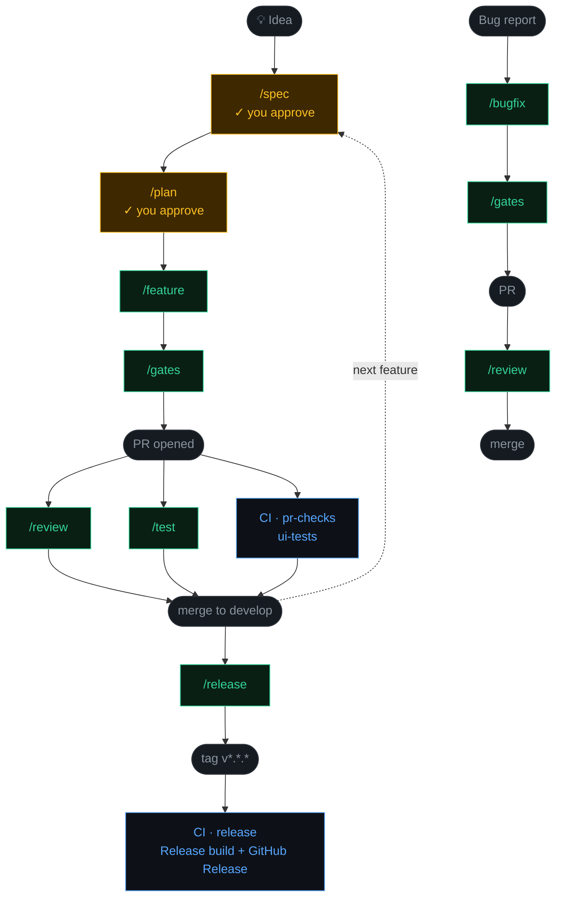

# Pragma

> You approve twice. Claude ships the rest.

[](./LICENSE)
[](https://claude.ai/code)
[](https://developer.apple.com/ios/)
[](https://swift.org)

The complete iOS development scaffold for the agentic era — agent commands, CI enforcement, and setup automation wired together so one engineer ships at team scale.

Proven on [FinanceTracker](https://github.com/akshaypimprikar/personal-finance-tracker) — a production SwiftUI + SwiftData app built entirely on this pipeline from day one, with specs, plans, and PRs going back to the first commit.

---

**[Quick Start](#quick-start) · [What You Get](#what-you-get) · [Pipeline](#pipeline) · [Commands](#commands) · [CI Layer](#ci-layer) · [Memory Layer](#memory-layer) · [Customising](#customising-for-your-project) · [Contributing](CONTRIBUTING.md)**

---

## Quick Start

```bash
git clone https://github.com/akshaypimprikar/pragma
cd pragma
./scripts/setup.sh MyApp /path/to/your-ios-project
```

The script copies all commands, context files, CI workflows, and support scripts into your project, substitutes your app name throughout, and generates a starter `CLAUDE.md`. No manual find-and-replace.

Then kick off your first feature:

```
/spec "describe your feature idea"
```

**After setup:**
1. Fill in `CLAUDE.md` — add your architecture rules and any project-specific constraints
2. Seed `.claude/context/invariants.md` with your non-negotiable rules before running `/feature`

---

## What You Get

Three layers installed into your project:

| Layer | Source | What it does |
|---|---|---|
| **Agent commands** | `.claude/commands/` | 13 Claude Code slash commands covering the full SDLC |
| **CI pipeline** | `scaffold/.github/workflows/` | 3 GitHub Actions workflows — PR checks, UI tests, and release |
| **Support scripts** | `scripts/` | Simulator selection and coverage enforcement for CI |

Each layer is independent — adopt all three or just the commands.

---

## Pipeline



You approve twice — after `/spec` and after `/plan`. Every other step is either an agent or automated CI.

---

## Commands

### Core pipeline

| Command | What it does |
|---|---|
| `/spec "feature idea"` | Proposes 2–3 approaches, you choose, spec doc saved |
| `/plan docs/specs/my-spec.md` | Turns an approved spec into a task-by-task implementation plan |
| `/feature docs/plans/my-plan.md` | Executes an approved plan — TDD, one commit per task |
| `/gates` | Verifies build, full test suite, and architecture compliance before PR |
| `/review` | Reviews a PR for architecture compliance |
| `/test` | Writes tests for a feature branch — run in parallel with `/review` |
| `/bugfix "description"` | Regression test first, then fix — test-first always |
| `/release 1.0.0` | Version bump, changelog, PR to main, git tag |

### Utility

| Command | What it does |
|---|---|
| `/design` | Establishes visual design tokens — run before `/spec` on UI features |
| `/pipeline-review` | Audits the pipeline for drift, gaps, and inefficiencies |
| `/status` | Reconstructs where work stands — use to resume any session |
| `/trim-context` | Trims accumulated context after completing a plan |
| `/sync-workflow` | Syncs this scaffold with your project's latest conventions |

---

## CI Layer

Three GitHub Actions workflows install into your project alongside the commands:

| Workflow | Trigger | What it enforces |
|---|---|---|
| `pr-checks.yml` | PR to `develop` or `main` | Unit + integration tests, coverage ≥ 60% (warn < 80%) |
| `ui-tests.yml` | PR to `develop` or `main`, push to either | UI tests |
| `release.yml` | Tag push matching `v*.*.*` | Full test suite in Release configuration, GitHub Release creation |

The agent layer (`/gates`, `/review`, `/test`) runs locally for fast feedback before a PR is opened. CI then re-runs the same checks independently as enforcement that can't be bypassed.

**Phase 2 — TestFlight upload** is documented but commented out in `release.yml`. It requires an Apple Developer Program membership, distribution certificate, and App Store Connect API key. When you're ready, the commented block shows exactly what to add.

---

## Memory Layer

The pipeline accumulates institutional knowledge across sessions in `.claude/context/`:

```
.claude/context/
├── invariants.md    — rules no agent may override (architecture, money types, etc.)
├── decisions.md     — log of every spec decision: approach chosen + reason
├── feature-log.md   — record of every feature shipped
└── rejections.md    — approaches ruled out, with reasons
```

Every agent reads these files before acting. Over time the pipeline carries the same context a senior engineer would — constraints, past decisions, and dead ends — surviving every session boundary.

Populate `invariants.md` before running `/feature` for the first time.

---

## How the Feature Agent Works

Each task in the plan follows strict TDD:

1. Write the failing test — confirm it fails for the right reason
2. Implement the minimal code to make it pass
3. Run the full test suite — no regressions allowed
4. Commit — one commit per task, no batching

The agent never proceeds to the next task if tests are red.

---

## Customising for Your Project

**Architecture assumptions (defaults — override in `CLAUDE.md`):**

- **MVVM + Repository** — views contain no business logic, ViewModels depend on protocols never concrete implementations
- **SwiftData** for persistence — Domain Services have zero SwiftData imports
- **Swift Testing** — `import Testing`, `@Suite`, `@Test`, `#expect()` for unit/integration tests; XCUITest for UI tests
- **`PBXFileSystemSynchronizedRootGroup`** (Xcode 16+) — files auto-compile when placed in the correct directory; never edit `project.pbxproj`

**Via script (recommended):**

```bash
./scripts/setup.sh MyApp /path/to/your-project
```

Copies everything and substitutes all placeholders. Then fill in `CLAUDE.md` and seed `invariants.md`.

**Or manually:**

1. Copy `.claude/commands/`, `.claude/context/`, `scaffold/.github/workflows/`, and `scripts/` into your project (place the workflows at `.github/workflows/`)
2. Replace `<AppName>` with your module name in each command file
3. Replace `YOUR_PROJECT` and `YOUR_SCHEME` in the three workflow files
4. Update `CLAUDE.md` with your build commands, simulator target, and architecture rules
5. Populate `.claude/context/invariants.md` with your non-negotiable rules
6. Update the Architecture Rules checklist in `/review` to match your stack

---

## Branch Strategy (Gitflow)

```
main        — production, tagged on release only
develop     — integration branch, all features merge here
feature/*   — off develop
fix/*        — off develop  (hotfix/* off main)
release/*   — off develop, PR to main, back-merged to develop
spec/*      — off develop, for spec + plan docs
```

---

## Author

Built by [Akshay Pimprikar](https://www.linkedin.com/in/akshaypimprikar) — iOS lead engineer building agentic AI pipelines.
