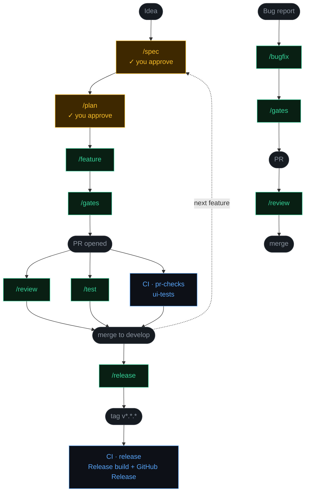

# Pragma

> You approve twice. Claude ships the rest.

[](./LICENSE)
[](https://claude.ai/code)
[](https://developer.apple.com/ios/)
[](https://swift.org)

Pragma is a scaffold for iOS development with Claude Code. It gives you agent commands, CI checks, and setup automation that work together. One engineer can use it to ship at team scale.

Pragma is not a spec-mode plugin for your IDE. It is not a loose collection of skills. It is a full pipeline from spec to release. In this pipeline, CI re-runs the TDD-order script (test-driven development: the test comes first), the gate-integrity script, and the test suite. Memory survives every session boundary. For the scope and limits of CI, see [CI Layer](#ci-layer). For a comparison with built-in spec modes, see [why not just a built-in spec mode](#why-not-just-cursor--windsurf--copilots-built-in-spec-mode).

Pragma is proven on [FinanceTracker](https://github.com/akshaypimprikar/financetracker-ios). FinanceTracker is a production SwiftUI and SwiftData app. It uses this pipeline from day one. Its specs, plans, and PRs go back to the first commit.

<p>
  
  
</p>

These screenshots are not mockups. They show what 100+ merged PRs of `/spec → /plan → /feature → /gates → /review` produce. For the full set of screenshots, see [FinanceTracker's README](https://github.com/akshaypimprikar/financetracker-ios).

---

[Quick Start](#quick-start) · [At a Glance](#at-a-glance-what-needs-you-and-what-does-not) · [What You Get](#what-you-get) · [Pipeline](#pipeline) · [Why Not a Spec Mode?](#why-not-just-cursor--windsurf--copilots-built-in-spec-mode) · [Commands](#commands) · [CI Layer](#ci-layer) · [Memory Layer](#memory-layer) · [Customising](#customising-for-your-project) · [Contributing](CONTRIBUTING.md)

---

## Quick Start

To install pragma as a Claude Code plugin, do these steps. You do not need to clone the repository or run a shell script.

Run these commands in Claude Code, in the root of your iOS project repository:

```
/plugin marketplace add akshaypimprikar/pragma
/plugin install pragma@pragma
/pragma:init MyApp
```

`/pragma:init` does the same work as `scripts/setup.sh`. It copies commands, context files, CI workflows, and support scripts. It replaces the placeholder app name in all of them. It also asks you questions about the architecture and key constraints of your app. It uses your answers for the content of `CLAUDE.md`. It also seeds `.claude/context/invariants.md` from the same answers. `setup.sh` leaves both files as templates for you to fill in later.

Or clone the repository and run the setup script:

```bash
git clone https://github.com/akshaypimprikar/pragma
cd pragma
./scripts/setup.sh MyApp /path/to/your-ios-project
```

The script copies the same files and replaces your app name. It leaves `CLAUDE.md` and `invariants.md` as templates. Before you run `/feature`, fill in both files yourself.

Both installers have safety behavior. `setup.sh` enforces it in the script. `/pragma:init` is a set of written instructions that the agent follows, so it is not a hard guarantee.

- Both installers stop if the target is the checkout of pragma itself. They resolve symlinks first.
- If `.claude/commands/` has files that differ from the files of pragma, the installers copy the whole directory to `.claude/commands.bak-<timestamp>/` before they overwrite it. This includes files from an earlier version of pragma or from a different app name. To re-apply your edits, compare the backup with the new files. Then delete the backup.
- The installers skip existing context files, `CONSTRAINTS.md`, `CLAUDE.md`, and workflow files. They do not overwrite them.
- The installers overwrite files in `scripts/`. If you edited `SCOPED_LAYER_DIRS`, re-apply your edit.

After either method, start your first feature:

```
/spec "describe your feature idea"
```

---

## At a glance: what needs you and what does not

| Stage | Command | Needs your approval? |
|---|---|---|
| Spec | `/spec` | Yes. You pick the approach. |
| Plan | `/plan` | Yes. You approve the task list. |
| Build | `/feature` | Autonomous |
| Pre-PR checks | `/gates` | Autonomous |
| Review | `/review` | Autonomous. It posts a real GitHub review. |
| Tests | `/test` | Autonomous |
| Release | `/release` | Autonomous |

You have two touchpoints: the spec and the plan. Everything from `/feature` to a merged, released PR runs without you.

---

## What You Get

Pragma installs three layers into your project:

| Layer | Source | What it does |
|---|---|---|
| Agent commands | `.claude/commands/` | 16 Claude Code slash commands that cover the full software development life cycle |
| CI pipeline | `scaffold/.github/workflows/` | 3 GitHub Actions workflows: PR checks, UI tests, and release |
| Support scripts | `scripts/` | Scripts for simulator selection, coverage enforcement, TDD-order checks, and gate-integrity checks. One optional script reduces simulator memory use in CI. |

Each layer is independent. You can adopt all three layers or only the commands.

---

## Pipeline


```mermaid
flowchart TD
    A([Idea]):::dim --> B
    B["/spec\n✓ you approve"]:::human --> C
    C["/plan\n✓ you approve"]:::human --> D
    D["/feature"]:::auto --> E
    E["/gates"]:::auto --> F
    F([PR opened]):::dim --> G & H & CI1
    CI1["CI · pr-checks\nui-tests"]:::ci --> I
    G["/review"]:::auto --> I
    H["/test"]:::auto --> I
    I([merge to develop]):::dim -.->|next feature| B
    I --> J["/release"]:::auto --> K([tag v*.*.*]):::dim --> CI2
    CI2["CI · release\nRelease build + GitHub Release"]:::ci

    BUG([Bug report]):::dim --> BF["/bugfix"]:::auto --> BG["/gates"]:::auto --> BP([PR]):::dim --> BR["/review"]:::auto --> BM([merge]):::dim

    classDef human fill:#3d2800,stroke:#fbbf24,color:#fbbf24
    classDef auto  fill:#0a1f14,stroke:#34d399,color:#34d399
    classDef dim   fill:#161b22,stroke:#30363d,color:#8b949e
    classDef ci    fill:#0d1117,stroke:#58a6ff,color:#58a6ff
```

You approve twice: after `/spec` and after `/plan`. An agent or automated CI does every other step.

### Harness Design

In April 2026, Martin Fowler wrote ["Harness Engineering for Coding Agent Users"](https://martinfowler.com/articles/exploring-gen-ai/harness-engineering.html). The article defines `Agent = Model + Harness`. It splits the harness into two parts. Feedforward guides steer the agent before it acts. Feedback sensors check what the agent did afterward. They check maintainability, architecture fitness, and behavioral correctness. This pipeline maps onto these categories:

| Fowler category | Pragma stage |
|---|---|
| Feedforward guides | `/spec`, `/plan`: they set the approach and constraints before the agent writes code |
| Feedback sensors: maintainability | `/gates`: checks for TODO/FIXME, branch naming, CHANGELOG, coverage, and abstraction bloat |
| Feedback sensors: architecture fitness | `/review`: checks layer separation, type safety, and established patterns |
| Feedback sensors: behavioral correctness | `/test`: runs the full suite and requires at least 80% coverage on new code |
| Recovery loop | `/bugfix`: writes a regression test first, then fixes the bug |

Fowler calls the behavioral-correctness sensor "the elephant in the room — still unsolved" for most agent harnesses. In this pipeline, `/test` and the coverage gate in `/gates` are the concrete attempt at that sensor.

---

## Why not just Cursor / Windsurf / Copilot's built-in spec mode?

Every major AI coding tool has shipped a form of spec-driven development. Examples are Cursor's Plan Mode, Windsurf's Cascade, GitHub Copilot workspace, GitHub Spec Kit, and BMAD-METHOD. So why use a separate scaffold instead of the spec mode that your IDE already has?

Pragma does three things that a spec mode alone does not do:

1. CI re-runs the script gates. The agent does not run them alone. `/gates` runs locally before a PR opens. A project that installs pragma also gets a `gates` job in `pr-checks.yml`. This job re-runs the RED-before-GREEN commit-order check (a failing test comes before the code that passes it) and the gate-integrity check. It uses the copies of those scripts from the base branch, so a PR cannot edit the scripts that judge it. CI does not re-run the gates that the agent judges. The job blocks a merge only if you mark it as a required status check. For the exact scope and limits, see [CI Layer](#ci-layer).
2. Memory lasts across sessions. It is not limited to one conversation. The files `.claude/context/decisions.md`, `invariants.md`, `feature-log.md`, and `rejections.md` persist across every session boundary. They carry forward what the pipeline decided, what no agent can override, what shipped, and what it tried and rejected. This works like the institutional memory of a senior engineer. Most spec-mode tools reset that context when the conversation ends. [addyosmani/agent-skills](https://github.com/addyosmani/agent-skills) (93K+ stars, one of the largest skill frameworks for coding agents) says that this problem is unsolved across the industry. Its [comparison doc](https://github.com/addyosmani/agent-skills/blob/main/docs/comparison.md) says: "None of these has solved durable cross-session memory well yet: what an agent learned in one session rarely carries cleanly into the next... If that is your bottleneck, know that you are at the edge of what any of them ships today, and expect to stitch some of it yourself for now." This pipeline is that stitching. It is already built and runs on a real codebase. It is not a future roadmap item.
3. Pragma is proven on a real codebase that is under active development and uses gitflow. It is not a demo repository. The codebase has 100+ merged PRs. A spec and a plan came before every feature, back to the first commit. This claim is different from "generates a plan.md", and you can check it. Read the PR history.

The built-in spec modes are not bad. They are a reasonable default for teams that already work in that IDE. Use pragma if you want two things. First, you want memory that survives independently of any one session, IDE, or agent run. Second, you want script-checkable gates that re-run in CI, not only in the session of the agent.

---

## Commands

### Core pipeline

| Command | What it does |
|---|---|
| `/spec "feature idea"` | Proposes 2–3 approaches. You choose one. It saves a spec document. |
| `/plan docs/specs/my-spec.md` | Turns an approved spec into a task-by-task implementation plan |
| `/feature docs/plans/my-plan.md` | Executes an approved plan with TDD, one commit per task |
| `/gates` | Makes sure that the build passes, the full test suite passes, and the architecture follows the rules, before you open a PR |
| `/review` | Reviews a PR for architecture compliance. Posts its verdict as a real GitHub review. |
| `/test` | Writes tests for a feature branch. Runs after `/review` reports APPROVED. |
| `/pr-followup` | Runs `/review`, `/test`, and `code-review:code-review` in a chain, right after a PR opens |
| `/bugfix "description"` | Writes a regression test first, then the fix. Always test first. |
| `/release 1.0.0` | Bumps the version, updates the changelog, opens a PR to main, and creates a git tag |

### Utility

| Command | What it does |
|---|---|
| `/design` | Sets the visual design tokens. Run it before `/spec` on UI features. |
| `/parallel-review` | Runs three checks against the branch diff: the Gate 10 architecture check from `/gates`, the design and code-quality checklists from `/review`, and then `code-review:code-review`. Run it after `/feature` and before `/gates`. |
| `/pipeline-review` | Audits the pipeline for drift, gaps, and inefficiencies |
| `/status` | Reconstructs where work stands. Use it to resume any session. |
| `/trim-context` | Trims accumulated context after completing a plan |
| `/sync-workflow` | Syncs this scaffold with your project's latest conventions |
| `/benchmark <label>` | Runs a fixed canary feature through the pipeline and logs objective metrics (commits, timing, gate results). Use it to compare pipeline changes against a baseline. Do not use it for feature work. |

### Standalone skills

These skills work in any project. You do not need the rest of the pipeline.

| Skill | What it does |
|---|---|
| [`deterministic-pr-gates`](skills/deterministic-pr-gates/SKILL.md) | Runs the checks before a PR that a script can run: build, tests, coverage, branch naming, and layer rules. Nearly every gate is a real command with a pass or fail result. Two gates are exceptions. In Gate 7 (security), a grep decides whether a security review runs, but the review itself is a judgment by an LLM or a person. Gate 8 (abstraction bloat) is advisory. |

---

## CI Layer

Pragma installs three GitHub Actions workflows into your project with the commands:

| Workflow | Trigger | What it enforces |
|---|---|---|
| `pr-checks.yml` | PR to `develop` or `main` | `unit-tests` job: unit and integration tests, and coverage of at least 60% (warning below 80%). `gates` job: RED-before-GREEN commit order and gate integrity. |
| `ui-tests.yml` | PR to `develop` or `main`, push to either | UI tests |
| `release.yml` | Tag push that matches `v*.*.*` | Full test suite in the Release configuration, and creation of the GitHub Release |

The agent layer (`/gates`, `/review`, `/test`) runs locally and gives fast feedback before you open a PR. CI re-runs only the part that a script can check:

- `gates` job (`pr-checks.yml`): runs `scripts/check_tdd_commit_order.py` and `scripts/check_gate_integrity.py`. The scripts come from a checkout of the base branch, and they run against the PR head. A PR cannot edit the scripts that judge it. If the base branch has no copy of a script, the copy in the PR runs and the job emits a warning. That run is not protected against a PR that edits the script. This is expected only for the PR that first installs pragma, but it applies to any PR while the base branch lacks the file. Any non-zero exit fails the job. This includes exit 2, which happens when `SCOPED_LAYER_DIRS` in `check_tdd_commit_order.py` still holds the layer names of the template. Edit `SCOPED_LAYER_DIRS` in the same PR that installs pragma. After the scripts are on the base branch, the existing copy on the base branch judges any PR that changes them, whether to configure them or to fix a bug.
- `unit-tests` job: runs the test suite and `scripts/check_coverage.py`. This job runs the copy of `check_coverage.py` from the PR, not a copy from the base branch.

CI does not re-run the parts that the agent judges. These are the `security-review` in Gate 7, the UI-selector cross-check in Gate 10 of `/gates`, and the design-compliance checklist in `/review`. CI also does not re-run the other `/gates` checks: the TODO/FIXME scan, branch naming, the CHANGELOG entry, per-file new-code coverage, the Gate 8 heuristics, and the Gate 10 architecture greps.

Know these limits before you rely on CI:

- CI is a hard block only if you make it one. Branch protection is opt-in. In a repository without it, a PR can merge with a red `gates` job. To enforce the block, do these steps in the GitHub repository:
  1. Open Settings → Branches (or Rules → Rulesets).
  2. Add a rule for `develop` and `main`.
  3. Turn on "Require status checks to pass before merging".
  4. Add `gates`. To make the unit tests and UI tests block too, add `Unit Tests` and `UI Tests`.

  `pr-checks.yml` runs only for the paths in its `paths:` filter. A required check that never runs stays pending. If you make `gates` required, remove that filter. This also makes the macOS `unit-tests` job run on every PR.
- The workflow file comes from the PR ref. A PR can still edit or delete the `gates` job itself. Only the scripts are protected. Review changes under `.github/workflows/` in the same way as changes to gate definitions. For example, add a `CODEOWNERS` entry for that path and require code-owner review.
- Gate integrity checks for edited gate-definition files only on `feature/*` branches. The PR author chooses the branch name. The same edit on a `chore/*` or `fix/*` branch is allowed by design. The other gate-integrity checks apply on any branch. They look for deleted tests, new suppressions, stubs, and lowered thresholds.
- On PRs into `main`, the TDD-order check reads every commit since `main`. If a repository squash-merges into `develop`, the check can flag squashed commits on a release PR. A squashed commit holds the test and the implementation in one commit.
- `setup.sh` and `/pragma:init` skip workflow files that already exist. In an existing project, you must copy the `gates` job from `scaffold/.github/workflows/pr-checks.yml` by hand.

By default, `/review` runs in the same Claude Code session as `/feature` and `/gates`. The reviewer is therefore not independent of the context of the implementer. `/review` does not trust the pasted gate summary. It compares the SHA of the summary with the PR head. It re-runs the scripted gates (gate integrity and TDD order) and the grep-only gates from the base branch. If anything disagrees, the result is CHANGES REQUESTED. `/review` does not re-run Gates 1, 2, 6, 7, and 8 (build, tests, coverage, security, and advisory heuristics). To isolate the context, run `/review` in a fresh Claude Code session.

Phase 2, the TestFlight upload, is documented but commented out in `release.yml`. It requires an Apple Developer Program membership, a distribution certificate, and an App Store Connect API key. When you are ready, the commented block shows what to add.

---

## Memory Layer

The pipeline stores knowledge across sessions in `.claude/context/`:

```
.claude/context/
├── invariants.md    — rules no agent may override (architecture, money types, etc.)
├── decisions.md     — log of every spec decision: approach chosen + reason
├── feature-log.md   — record of every feature shipped
└── rejections.md    — approaches ruled out, with reasons
```

Every agent reads these files before it acts. Over time, the pipeline carries the same context that a senior engineer carries: constraints, past decisions, and dead ends. It survives every session boundary.

Before you run `/feature` for the first time, fill in `invariants.md`.

---

## How the Feature Agent Works

Each task in the plan follows strict TDD:

1. Write the failing test. Make sure that it fails for the right reason.
2. Write the minimum code to make the test pass.
3. Run the full test suite. No regressions are allowed.
4. Commit. Make one commit per task. Do not batch commits.

If tests are red, the agent does not go to the next task.

---

## Customising for Your Project

These are the default architecture assumptions. To override them, edit `CLAUDE.md`.

- MVVM and Repository: views contain no business logic. ViewModels depend on protocols, never on concrete implementations.
- SwiftData for persistence: Domain Services have zero SwiftData imports.
- Swift Testing: use `import Testing`, `@Suite`, `@Test`, and `#expect()` for unit and integration tests. Use XCUITest for UI tests.
- `PBXFileSystemSynchronizedRootGroup` (Xcode 16 and later): files compile automatically when you place them in the correct directory. Never edit `project.pbxproj`.

To customise with the script (recommended), run:

```bash
./scripts/setup.sh MyApp /path/to/your-project
```

The script copies everything and replaces all placeholders. Then fill in `CLAUDE.md` and seed `invariants.md`.

To customise by hand, do these steps:

1. Copy `.claude/commands/`, `.claude/context/`, `scaffold/.github/workflows/`, and `scripts/` into your project. Put the workflows in `.github/workflows/`.
2. Replace `<AppName>` with your module name in each command file
3. Replace `YOUR_PROJECT` and `YOUR_SCHEME` in the three workflow files
4. Update `CLAUDE.md` with your build commands, simulator target, and architecture rules
5. Fill in `.claude/context/invariants.md` with your non-negotiable rules
6. Update the Architecture Rules checklist in `/review` to match your stack

---

## Branch Strategy (Gitflow)

```
main        — production, tagged on release only
develop     — integration branch, all features merge here
feature/*   — off develop
fix/*        — off develop  (hotfix/* off main)
release/*   — off develop, PR to main, back-merged to develop
spec/*      — off develop, for spec + plan docs
```

---

## Author

[Akshay Pimprikar](https://www.linkedin.com/in/akshaypimprikar) built pragma. Akshay is an iOS lead engineer who builds agentic AI pipelines.
