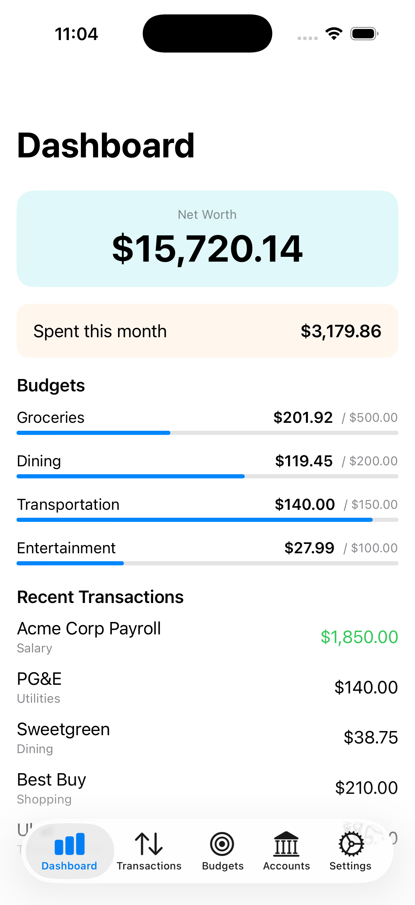
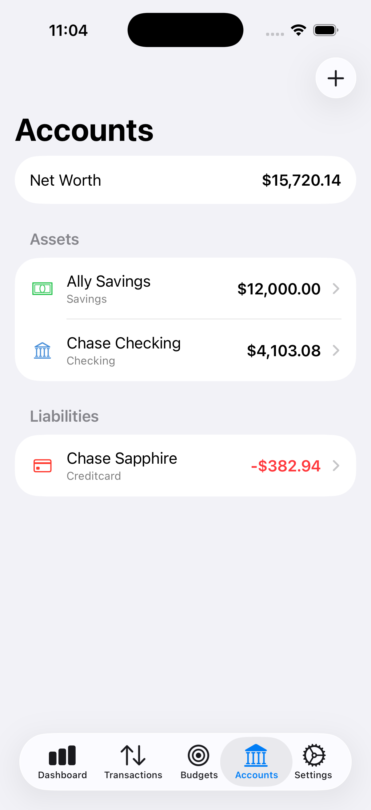
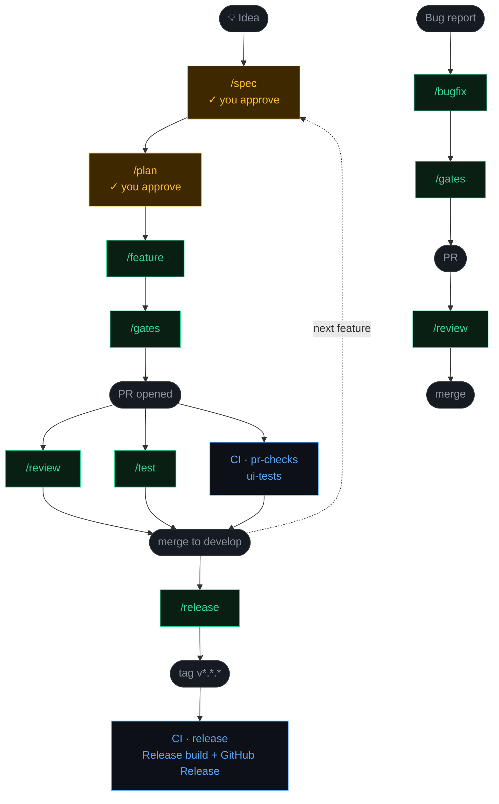

# Pragma

> You approve twice. Claude ships the rest.

[](./LICENSE)
[](https://claude.ai/code)
[](https://developer.apple.com/ios/)
[](https://swift.org)

The complete iOS development scaffold for the agentic era — agent commands, CI enforcement, and setup automation wired together so one engineer ships at team scale.

Proven on [FinanceTracker](https://github.com/akshaypimprikar/financetracker-ios) — a production SwiftUI + SwiftData app built entirely on this pipeline from day one, with specs, plans, and PRs going back to the first commit.

<p>
  
  
</p>

Not a mockup — this is what 80+ merged PRs of `/spec → /plan → /feature → /gates → /review` actually produce. Full screenshot set in [FinanceTracker's README](https://github.com/akshaypimprikar/financetracker-ios).

---

**[Quick Start](#quick-start) · [What You Get](#what-you-get) · [Pipeline](#pipeline) · [Why Not a Spec Mode?](#why-not-just-cursor--windsurf--copilots-built-in-spec-mode) · [Commands](#commands) · [CI Layer](#ci-layer) · [Memory Layer](#memory-layer) · [Customising](#customising-for-your-project) · [Contributing](CONTRIBUTING.md)**

---

## Quick Start

**Recommended — install as a Claude Code plugin, no clone or shell script:**

Inside Claude Code, in your iOS project's repo root:

```
/plugin marketplace add akshaypimprikar/pragma
/plugin install pragma@pragma
/pragma:init MyApp
```

`/pragma:init` does what `scripts/setup.sh` does — copies commands, context files, CI workflows, and support scripts, substitutes your app name throughout — but interviews you for `CLAUDE.md`'s architecture and key-constraints content and seeds `.claude/context/invariants.md` from the same answers, instead of leaving both as templates to fill in later.

**Alternative — clone and run the setup script directly:**

```bash
git clone https://github.com/akshaypimprikar/pragma
cd pragma
./scripts/setup.sh MyApp /path/to/your-ios-project
```

This copies the same files and substitutes your app name, but leaves `CLAUDE.md` and `invariants.md` as templates — fill them in yourself before running `/feature`.

Then, either way, kick off your first feature:

```
/spec "describe your feature idea"
```

---

## What You Get

Three layers installed into your project:

| Layer | Source | What it does |
|---|---|---|
| **Agent commands** | `.claude/commands/` | 16 Claude Code slash commands covering the full SDLC |
| **CI pipeline** | `scaffold/.github/workflows/` | 3 GitHub Actions workflows — PR checks, UI tests, and release |
| **Support scripts** | `scripts/` | Simulator selection, coverage enforcement, and optional simulator memory slimming for CI |

Each layer is independent — adopt all three or just the commands.

---

## Pipeline


```mermaid
flowchart TD
    A([💡 Idea]):::dim --> B
    B["/spec\n✓ you approve"]:::human --> C
    C["/plan\n✓ you approve"]:::human --> D
    D["/feature"]:::auto --> E
    E["/gates"]:::auto --> F
    F([PR opened]):::dim --> G & H & CI1
    CI1["CI · pr-checks\nui-tests"]:::ci --> I
    G["/review"]:::auto --> I
    H["/test"]:::auto --> I
    I([merge to develop]):::dim -.->|next feature| B
    I --> J["/release"]:::auto --> K([tag v*.*.*]):::dim --> CI2
    CI2["CI · release\nRelease build + GitHub Release"]:::ci

    BUG([Bug report]):::dim --> BF["/bugfix"]:::auto --> BG["/gates"]:::auto --> BP([PR]):::dim --> BR["/review"]:::auto --> BM([merge]):::dim

    classDef human fill:#3d2800,stroke:#fbbf24,color:#fbbf24
    classDef auto  fill:#0a1f14,stroke:#34d399,color:#34d399
    classDef dim   fill:#161b22,stroke:#30363d,color:#8b949e
    classDef ci    fill:#0d1117,stroke:#58a6ff,color:#58a6ff
```

You approve twice — after `/spec` and after `/plan`. Every other step is either an agent or automated CI.

### Harness Design

Martin Fowler's ["Harness Engineering for Coding Agent Users"](https://martinfowler.com/articles/exploring-gen-ai/harness-engineering.html) (April 2026) frames `Agent = Model + Harness`, splitting the harness into **feedforward guides** (steer the agent before it acts) and **feedback sensors** (verify what it did after, across maintainability, architecture fitness, and behavioral correctness). This pipeline maps directly onto that taxonomy:

| Fowler category | Pragma stage |
|---|---|
| Feedforward guides | `/spec`, `/plan` — establish approach and constraints before code is written |
| Feedback sensors — maintainability | `/gates` — TODO/FIXME, branch naming, CHANGELOG, coverage, abstraction bloat |
| Feedback sensors — architecture fitness | `/review` — layer separation, type safety, established patterns |
| Feedback sensors — behavioral correctness | `/test` — full suite, ≥80% coverage on new code |
| Recovery loop | `/bugfix` — regression test first, then fix |

Fowler calls the behavioral-correctness sensor "the elephant in the room — still unsolved" for most agent harnesses. `/test` plus `/gates`' coverage gate are this pipeline's concrete attempt at that sensor.

---

## Why not just Cursor / Windsurf / Copilot's built-in spec mode?

Every major AI coding tool has shipped some flavor of spec-driven development — Cursor's Plan Mode, Windsurf's Cascade, GitHub Copilot workspace, GitHub Spec Kit, BMAD-METHOD, and others. Fair question: why a separate scaffold instead of using what's already built into the IDE?

Three things pragma does that a spec mode alone doesn't:

1. **CI-enforced, not just agent-enforced.** `/gates` runs locally before a PR opens; the same checks re-run independently in GitHub Actions (`pr-checks.yml`, `ui-tests.yml`) as enforcement that can't be skipped by rerunning the agent with a different prompt. Spec modes generate a plan; they don't wire in an enforcement layer the agent itself can't talk its way around.
2. **Cross-session memory, not per-conversation context.** `.claude/context/decisions.md`, `invariants.md`, and `rejections.md` persist across every session boundary — the pipeline carries forward what was decided, what's inviolable, and what's been tried and rejected, the way a senior engineer's institutional memory would. Most spec-mode tools reset that context at the conversation edge.
3. **Proven on a real, actively-developed, gitflow-integrated codebase**, not a demo repo — 70+ merged PRs, specs and plans predating every feature, going back to the first commit. That's a different claim than "generates a plan.md," and it's checkable: read the actual PR history.

None of this makes the built-in spec modes bad — they're a reasonable default for teams already inside that IDE. Pragma is for when you want the enforcement and the memory to survive independently of any one session, IDE, or agent run.

---

## Commands

### Core pipeline

| Command | What it does |
|---|---|
| `/spec "feature idea"` | Proposes 2–3 approaches, you choose, spec doc saved |
| `/plan docs/specs/my-spec.md` | Turns an approved spec into a task-by-task implementation plan |
| `/feature docs/plans/my-plan.md` | Executes an approved plan — TDD, one commit per task |
| `/gates` | Verifies build, full test suite, and architecture compliance before PR |
| `/review` | Reviews a PR for architecture compliance, posts its verdict as a real GitHub review |
| `/test` | Writes tests for a feature branch — runs after `/review` reports APPROVED |
| `/pr-followup` | Auto-chains `/review` then `/test` right after a PR opens |
| `/bugfix "description"` | Regression test first, then fix — test-first always |
| `/release 1.0.0` | Version bump, changelog, PR to main, git tag |

### Utility

| Command | What it does |
|---|---|
| `/design` | Establishes visual design tokens — run before `/spec` on UI features |
| `/parallel-review` | Runs `/review`'s architecture checklist and `code-review:code-review` in parallel on the branch diff, after `/feature`, before `/gates` |
| `/pipeline-review` | Audits the pipeline for drift, gaps, and inefficiencies |
| `/status` | Reconstructs where work stands — use to resume any session |
| `/trim-context` | Trims accumulated context after completing a plan |
| `/sync-workflow` | Syncs this scaffold with your project's latest conventions |
| `/benchmark <label>` | Runs a fixed canary feature through the pipeline and logs objective metrics (commits, timing, gate results) — for comparing pipeline changes against a baseline, not for feature work |

### Standalone skills

Unlike the commands above, these work in any project without adopting the rest of the pipeline.

| Skill | What it does |
|---|---|
| [`deterministic-pr-gates`](skills/deterministic-pr-gates/SKILL.md) | Scriptable, checkable pre-PR verification (build, tests, coverage, branch naming, layer rules) — every gate is a real command with a pass/fail outcome, none of it asks an LLM to judge the diff |

---

## CI Layer

Three GitHub Actions workflows install into your project alongside the commands:

| Workflow | Trigger | What it enforces |
|---|---|---|
| `pr-checks.yml` | PR to `develop` or `main` | Unit + integration tests, coverage ≥ 60% (warn < 80%) |
| `ui-tests.yml` | PR to `develop` or `main`, push to either | UI tests |
| `release.yml` | Tag push matching `v*.*.*` | Full test suite in Release configuration, GitHub Release creation |

The agent layer (`/gates`, `/review`, `/test`) runs locally for fast feedback before a PR is opened. CI then re-runs the same checks independently as enforcement that can't be bypassed.

**Phase 2 — TestFlight upload** is documented but commented out in `release.yml`. It requires an Apple Developer Program membership, distribution certificate, and App Store Connect API key. When you're ready, the commented block shows exactly what to add.

---

## Memory Layer

The pipeline accumulates institutional knowledge across sessions in `.claude/context/`:

```
.claude/context/
├── invariants.md    — rules no agent may override (architecture, money types, etc.)
├── decisions.md     — log of every spec decision: approach chosen + reason
├── feature-log.md   — record of every feature shipped
└── rejections.md    — approaches ruled out, with reasons
```

Every agent reads these files before acting. Over time the pipeline carries the same context a senior engineer would — constraints, past decisions, and dead ends — surviving every session boundary.

Populate `invariants.md` before running `/feature` for the first time.

---

## How the Feature Agent Works

Each task in the plan follows strict TDD:

1. Write the failing test — confirm it fails for the right reason
2. Implement the minimal code to make it pass
3. Run the full test suite — no regressions allowed
4. Commit — one commit per task, no batching

The agent never proceeds to the next task if tests are red.

---

## Customising for Your Project

**Architecture assumptions (defaults — override in `CLAUDE.md`):**

- **MVVM + Repository** — views contain no business logic, ViewModels depend on protocols never concrete implementations
- **SwiftData** for persistence — Domain Services have zero SwiftData imports
- **Swift Testing** — `import Testing`, `@Suite`, `@Test`, `#expect()` for unit/integration tests; XCUITest for UI tests
- **`PBXFileSystemSynchronizedRootGroup`** (Xcode 16+) — files auto-compile when placed in the correct directory; never edit `project.pbxproj`

**Via script (recommended):**

```bash
./scripts/setup.sh MyApp /path/to/your-project
```

Copies everything and substitutes all placeholders. Then fill in `CLAUDE.md` and seed `invariants.md`.

**Or manually:**

1. Copy `.claude/commands/`, `.claude/context/`, `scaffold/.github/workflows/`, and `scripts/` into your project (place the workflows at `.github/workflows/`)
2. Replace `<AppName>` with your module name in each command file
3. Replace `YOUR_PROJECT` and `YOUR_SCHEME` in the three workflow files
4. Update `CLAUDE.md` with your build commands, simulator target, and architecture rules
5. Populate `.claude/context/invariants.md` with your non-negotiable rules
6. Update the Architecture Rules checklist in `/review` to match your stack

---

## Branch Strategy (Gitflow)

```
main        — production, tagged on release only
develop     — integration branch, all features merge here
feature/*   — off develop
fix/*        — off develop  (hotfix/* off main)
release/*   — off develop, PR to main, back-merged to develop
spec/*      — off develop, for spec + plan docs
```

---

## Author

Built by [Akshay Pimprikar](https://www.linkedin.com/in/akshaypimprikar) — iOS lead engineer building agentic AI pipelines.
